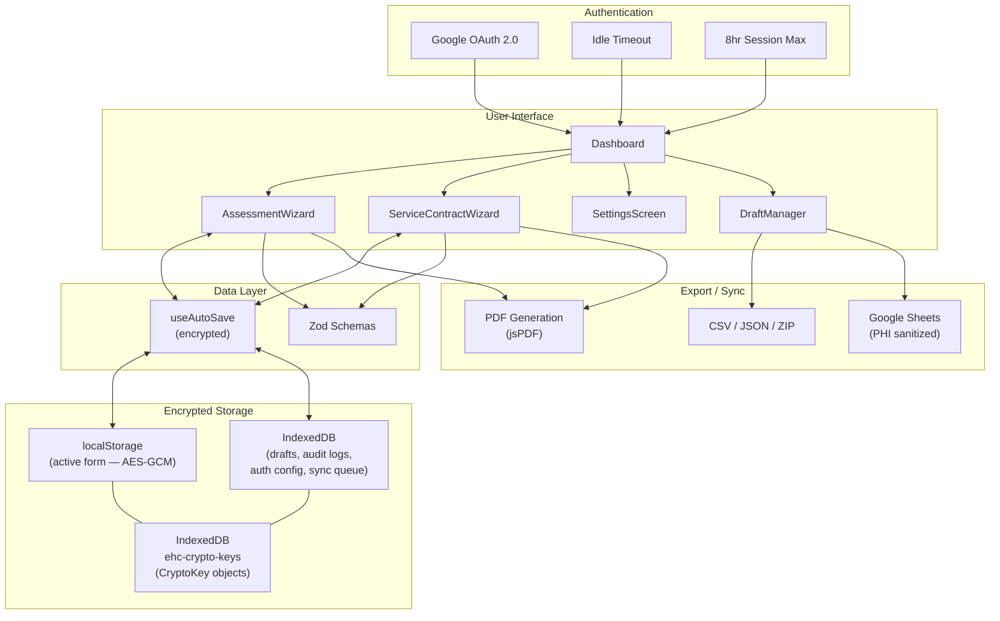
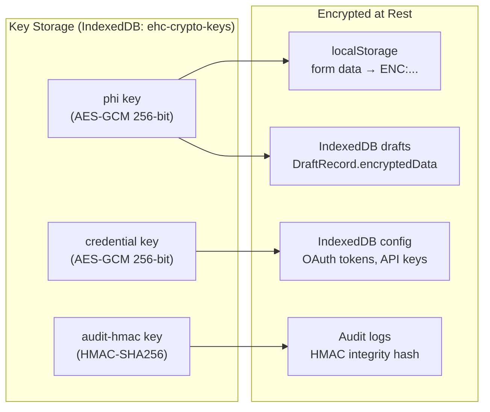

# EHC Client Intake Assessment App

A HIPAA-conscious, offline-capable Progressive Web App (PWA) for Executive Home Care franchise locations to digitize client intake assessments and service contract workflows.

Replaces the 8-page paper assessment packet with a guided, multi-step wizard that works on tablets during home visits — even without internet.

## Features

- **Assessment Wizard** — 7-step guided intake: client info, medical history, functional assessment (16 categories), home safety checklist (66 items), medications, HIPAA consent & signatures, review & submit
- **Service Contract Wizard** — 7-step service agreement: customer info & payment, terms & conditions (6 legal sections), consumer rights, direct care worker notice, transportation request, customer packet acknowledgments, review & submit
- **Assessment-to-Contract Pre-fill** — Client data flows from completed assessment into service contract automatically
- **Offline-First PWA** — Service worker with precaching; works in homes without Wi-Fi
- **AES-GCM Encryption** — All PHI encrypted at rest (localStorage + IndexedDB) via Web Crypto API
- **Google OAuth Login** — Access control with allowed-email list + configurable idle timeout
- **Digital Signatures** — Draw or type-to-sign with timestamp metadata
- **PDF Export** — Professional multi-page PDF with branded headers, concern highlighting, signature images
- **Google Sheets Sync** — OAuth 2.0 sync with PHI masking (sanitized before transmission)
- **Audit Logging** — 27 action types with HMAC-SHA256 tamper evidence, CSV export
- **Draft Management** — Auto-save, IndexedDB draft storage, resume from any device
- **Data Export** — PDF, CSV, JSON, bulk ZIP export
- **WCAG AA Accessible** — Skip navigation, focus traps, aria attributes, 4.5:1 contrast ratios, 44px touch targets
- 🌙 **Dark Mode** — System/light/dark with auto-detect
- 🔍 **Draft Search & Filters** — Draft search, type filter, and sort
- 🔒 **HIPAA Minimum Necessary** — Export filters with 7 PHI category toggles
- 📋 **HIPAA Compliance Checklist** — Self-audit checklist in Settings
- ✏️ **Signature Undo** — Undo last stroke on signature pads
- ⏱️ **Idle Timeout** — Configurable auto-lock (5/10/15/30 min) with warning countdown
- ⌨️ **Keyboard Navigation** — Arrow keys in toggle card groups

## Tech Stack

| Layer | Technology |
|-------|-----------|
| Framework | React 19 + TypeScript 5.9 |
| Styling | Tailwind CSS 4 |
| Validation | Zod 4 |
| PDF Generation | jsPDF + jspdf-autotable (dynamic import) |
| Bulk Export | JSZip (dynamic import) |
| Signatures | react-signature-canvas |
| Build Tool | Vite 7 |
| PWA | vite-plugin-pwa (Workbox) |
| Unit Tests | Vitest 4 + Testing Library |
| E2E Tests | Playwright + Chromium |
| CI/CD | GitHub Actions |
| Hosting | Netlify (configured) |

## Quick Start

### Prerequisites

- Node.js 22+ (see `.node-version`)
- npm 10+

### Development

```bash
# Clone and install
git clone <repo-url>
cd ehc-assessment
npm install

# Start dev server
npm run dev
# → http://localhost:5173

# Run tests
npm test              # 415 unit tests
npm run test:e2e      # 16 E2E tests (requires Playwright browsers)

# Type check
npx tsc --noEmit

# Production build
npm run build
npm run preview       # Preview production build locally
```

### First-Time Setup

1. **Start the app** — navigates to Dashboard
2. **Settings** (gear icon) — configure:
   - Google OAuth Client ID (for login gate + Sheets sync)
   - Allowed email addresses
   - Idle timeout duration
   - Google Sheets connection (optional)
3. **New Assessment** — start a client intake

> **Note:** Authentication is enabled by default. To use the app without Google OAuth during development, disable `requireAuth` in Settings.

## Architecture

```
src/
  App.tsx                    # Thin routing layer (AppView state machine)
  main.tsx                   # Entry point + global error handlers
  components/
    Dashboard.tsx            # Landing: New Assessment, New Contract, Resume Draft, Settings
    LoginScreen.tsx          # Google OAuth login gate
    SettingsScreen.tsx       # Admin: auth, Sheets, data management, audit log viewer
    AssessmentWizard.tsx     # Assessment orchestrator (7 steps)
    ServiceContractWizard.tsx # Contract orchestrator (7 steps)
    DraftManager.tsx         # Dual-type draft list with search & filters
    ErrorBoundary.tsx        # Per-wizard error boundary with recovery UI
    wizard/                  # WizardShell, ProgressBar
    forms/                   # 7 assessment form components
    forms/contract/          # 7 contract form components
    ui/                      # Shared: ToggleCard, CategoryCard, SignaturePad, ThemeToggle, ToggleCardGroup, etc.
  hooks/
    useAutoSave.ts           # Encrypted auto-save (async init, AES-GCM)
    useFormWizard.ts         # Step navigation state
    useStepValidation.ts     # Zod validation with per-field clearing
    useIdleTimeout.ts        # Activity tracking + session timeout
    useFocusTrap.ts          # Modal focus trap (Tab/Shift+Tab)
    useDarkMode.ts           # Dark mode (system/light/dark with auto-detect)
  validation/
    schemas.ts               # Assessment Zod schemas (7 steps)
    contractSchemas.ts       # Contract Zod schemas (7 steps)
  types/
    navigation.ts            # AppView discriminated union
    forms.ts                 # Assessment data interfaces
    serviceContract.ts       # Contract data interfaces
    auth.ts                  # AuthUser, AuthConfig
  utils/
    crypto.ts                # AES-GCM encryption + HMAC integrity
    auditLog.ts              # Audit trail (29 actions, HMAC, CSV export)
    db.ts                    # IndexedDB: drafts, sync queue, auth config, audit logs
    logger.ts                # __DEV__-gated logger (dead-code eliminated in prod)
    sheetsApi.ts             # Google Sheets sync + PHI sanitization
    googleAuth.ts            # Google Identity Services wrapper
    exportData.ts            # Assessment CSV/JSON/ZIP export
    contractExportData.ts    # Contract CSV/JSON export
    prefill.ts               # Assessment → Contract data mapping
    fetchWithTimeout.ts      # Safe fetch with timeout (AbortController)
    exportFilters.ts         # HIPAA Minimum Necessary export filters (PHI category toggles)
    phiFieldDetection.ts     # PHI field detection for export filtering
    pdf/                     # PDF generation (12 section renderers)
```

### Data Flow Diagram



### Encryption Architecture



## Testing

```bash
npm test                 # Run all 415 unit tests
npm run test:watch       # Watch mode
npm run test:e2e         # 16 Playwright E2E tests (smoke + accessibility)
npx tsc --noEmit         # TypeScript type checking
```

### Test Coverage

**29 test files — 415 unit tests**

| Suite | Tests | What's Covered |
|-------|-------|---------------|
| **Validation** | | |
| schemas.test.ts | 19 | Assessment Zod validation |
| contractSchemas.test.ts | 26 | Contract Zod validation |
| **Data Export** | | |
| exportData.test.ts | 35 | CSV/JSON export + CSV injection prevention |
| contractExportData.test.ts | 18 | Contract export |
| exportFilters.test.ts | 11 | HIPAA Minimum Necessary export filters |
| **Security & Encryption** | | |
| crypto.test.ts | 16 | AES-GCM encrypt/decrypt, HMAC |
| security.test.ts | 22 | PHI encryption at rest, HMAC integrity, PHI sanitization |
| auditLog.test.ts | 10 | Audit trail, HMAC, filtering, purge |
| **Data Persistence** | | |
| db.test.ts | 16 | IndexedDB CRUD, encryption round-trips, purge |
| useAutoSave.test.ts | 16 | Async init, encryption, migration, debounce |
| autoSaveMigration.test.ts | 4 | Schema migration |
| sheetsConfig.test.ts | 14 | Sheets config persistence |
| **Hooks** | | |
| useFormWizard.test.ts | 19 | Step navigation, bounds clamping, progress |
| useStepValidation.test.ts | 12 | Per-field validation, error clearing |
| useIdleTimeout.test.ts | 5 | Idle timeout behavior |
| useFocusTrap.test.ts | 4 | Modal focus trapping |
| useDarkMode.test.ts | 6 | Dark mode (system/light/dark, auto-detect) |
| useOnlineStatus.test.ts | 5 | Online/offline detection, event cleanup |
| **Google Sheets** | | |
| sheetsApi.test.ts | 20 | Connection, read/write, sync guards, auth headers |
| useSheetsSync.test.ts | 11 | Config loading, sync draft, error handling |
| sanitizeForSync.test.ts | 12 | PHI masking for Sheets |
| **PDF** | | |
| pdfGenerators.test.ts | 17 | Completeness checks, filename generation |
| pdfBanner.test.ts | 6 | PDF header layout |
| isAssessmentComplete.test.ts | 11 | Assessment completeness |
| **Utilities** | | |
| phiFieldDetection.test.ts | 35 | PHI field detection (8 categories) |
| prefill.test.ts | 27 | Assessment → Contract mapping |
| assessmentTemplates.test.ts | 11 | Template system |
| fetchWithTimeout.test.ts | 3 | Fetch timeout utility |
| logger.test.ts | 4 | Dev-only logging, prod silent |

## Deployment

See [docs/DEPLOYMENT.md](docs/DEPLOYMENT.md) for full deployment instructions.

**Quick deploy to Netlify:**
1. Connect your Git repository to Netlify
2. Build command: `npm run build`
3. Publish directory: `dist`
4. Node version: 22 (auto-detected from `.node-version`)

All security headers (HSTS, CSP, X-Frame-Options, etc.) are configured in `netlify.toml`.

## Documentation

| Document | Description |
|----------|-------------|
| [Deployment Guide](docs/DEPLOYMENT.md) | Netlify setup, security headers, environment |
| [Security](docs/SECURITY.md) | Encryption, authentication, session management |
| [HIPAA Compliance](docs/HIPAA.md) | PHI handling, consent, audit trail |
| [Google Sheets Setup](docs/GOOGLE-SHEETS-SETUP.md) | OAuth config, spreadsheet structure |
| [Contributing](CONTRIBUTING.md) | Dev setup, testing, coding conventions |

## License

Proprietary — Executive Home Care. All rights reserved.
