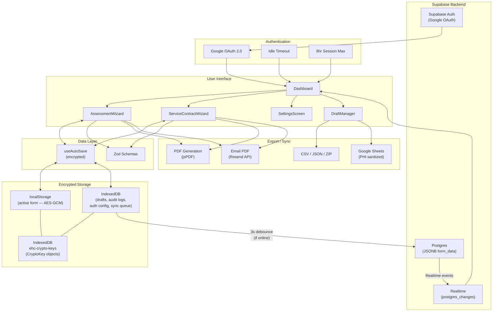
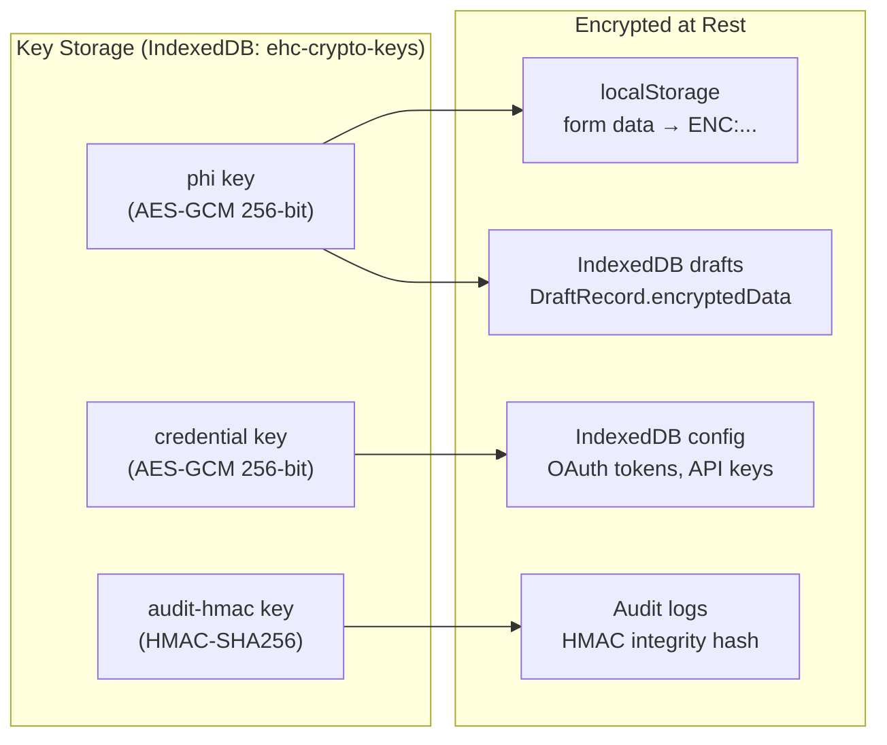

# EHC Client Intake Assessment App

A HIPAA-conscious, offline-capable Progressive Web App (PWA) for Executive Home Care franchise locations to digitize client intake assessments and service contract workflows.

Replaces the 8-page paper assessment packet with a guided, multi-step wizard that works on tablets during home visits — even without internet.

## Features

- **Assessment Wizard** — 7-step guided intake: client info, medical history, functional assessment (16 categories), home safety checklist (66 items), medications, HIPAA consent & signatures, review & submit
- **Service Contract Wizard** — 7-step service agreement: customer info & payment, terms & conditions (6 legal sections), consumer rights, direct care worker notice, transportation request, customer packet acknowledgments, review & submit
- **Assessment-to-Contract Pre-fill** — Client data flows from completed assessment into service contract automatically
- **Offline-First PWA** — Service worker with precaching; works in homes without Wi-Fi
- **AES-GCM Encryption** — All PHI encrypted at rest (localStorage + IndexedDB) via Web Crypto API
- **Google OAuth Login** — Access control with allowed-email list + configurable idle timeout
- **Digital Signatures** — Draw or type-to-sign with timestamp metadata
- **PDF Export** — Professional multi-page PDF with branded headers, concern highlighting, signature images
- **Google Sheets Sync** — OAuth 2.0 sync with PHI masking (sanitized before transmission)
- **Audit Logging** — 27 action types with HMAC-SHA256 tamper evidence, CSV export, dual-write to Supabase
- **Multi-Device Sync** — Supabase Postgres backend with real-time subscriptions, optimistic concurrency, draft locking, conflict resolution
- **Draft Management** — Auto-save, IndexedDB draft storage, resume from any device, cross-device sync via Supabase
- **Data Export** — PDF, CSV, JSON, bulk ZIP export
- **Email PDF** — Send assessment/contract PDFs directly from the app via Resend API with branded HTML template
- **Email Templates** — Configurable subject/body templates with {clientName}, {date}, {staffName} placeholders, default CC, signature
- **WCAG AA Accessible** — Skip navigation, focus traps, aria attributes, 4.5:1 contrast ratios, 44px touch targets
- 🌙 **Dark Mode** — System/light/dark with auto-detect
- 🔍 **Draft Search & Filters** — Draft search, type filter, and sort
- 🔒 **HIPAA Minimum Necessary** — Export filters with 7 PHI category toggles
- 📋 **HIPAA Compliance Checklist** — Self-audit checklist in Settings
- ✏️ **Signature Undo** — Undo last stroke on signature pads
- ⏱️ **Idle Timeout** — Configurable auto-lock (5/10/15/30 min) with warning countdown
- ⌨️ **Keyboard Navigation** — Arrow keys in toggle card groups

## Tech Stack

| Layer | Technology |
|-------|-----------|
| Framework | React 19 + TypeScript 5.9 |
| Styling | Tailwind CSS 4 |
| Validation | Zod 4 |
| PDF Generation | jsPDF + jspdf-autotable (dynamic import) |
| Bulk Export | JSZip (dynamic import) |
| Signatures | react-signature-canvas |
| Build Tool | Vite 7 |
| PWA | vite-plugin-pwa (Workbox) |
| Unit Tests | Vitest 4 + Testing Library |
| E2E Tests | Playwright + Chromium |
| CI/CD | GitHub Actions |
| Backend | Supabase (Postgres + Auth + Realtime) |
| Hosting | Netlify (configured) |
| Email Delivery | Resend REST API (via Netlify Function) |

## Quick Start

### Prerequisites

- Node.js 22+ (see `.node-version`)
- npm 10+

### Development

```bash
# Clone and install
git clone <repo-url>
cd ehc-assessment
npm install

# Start dev server
npm run dev
# → http://localhost:5173

# Run tests
npm test              # 587 unit tests
npm run test:e2e      # 16 E2E tests (requires Playwright browsers)

# Type check
npx tsc --noEmit

# Production build
npm run build
npm run preview       # Preview production build locally
```

### First-Time Setup

1. **Start the app** — navigates to Dashboard
2. **Settings** (gear icon) — configure:
   - Google OAuth Client ID (for login gate + Sheets sync)
   - Allowed email addresses
   - Idle timeout duration
   - Google Sheets connection (optional)
   - Email: Set `RESEND_API_KEY` and `EHC_EMAIL_FROM` in Netlify env vars for PDF email delivery
3. **New Assessment** — start a client intake

> **Note:** Authentication is enabled by default. To use the app without Google OAuth during development, disable `requireAuth` in Settings.

## Architecture

```
src/
  App.tsx                    # Thin routing layer (AppView state machine)
  main.tsx                   # Entry point + global error handlers
  components/
    Dashboard.tsx            # Landing: New Assessment, New Contract, Resume Draft, Settings
    LoginScreen.tsx          # Google OAuth login gate
    SettingsScreen.tsx       # Admin: auth, Sheets, data management, audit log viewer
    AssessmentWizard.tsx     # Assessment orchestrator (7 steps)
    ServiceContractWizard.tsx # Contract orchestrator (7 steps)
    DraftManager.tsx         # Dual-type draft list with search & filters
    ErrorBoundary.tsx        # Per-wizard error boundary with recovery UI
    wizard/                  # WizardShell, ProgressBar
    forms/                   # 7 assessment form components
    forms/contract/          # 7 contract form components
    ui/                      # Shared: ToggleCard, CategoryCard, SignaturePad, ThemeToggle, ToggleCardGroup, EmailComposeModal, ConflictResolutionModal, etc.
  hooks/
    useAutoSave.ts           # Encrypted auto-save (async init, AES-GCM)
    useFormWizard.ts         # Step navigation state
    useStepValidation.ts     # Zod validation with per-field clearing
    useIdleTimeout.ts        # Activity tracking + session timeout
    useFocusTrap.ts          # Modal focus trap (Tab/Shift+Tab)
    useDarkMode.ts           # Dark mode (system/light/dark with auto-detect)
    useOnlineStatus.ts       # Online/offline detection
    useSupabaseAuth.ts       # Supabase Google OAuth (graceful GIS fallback)
    useSupabaseSync.ts       # Background sync + offline queue + conflict resolution
    useSupabaseDrafts.ts     # Remote draft list with Realtime subscription
    useDraftLock.ts          # Draft locking (30-min expiry, 5-min renewal)
  validation/
    schemas.ts               # Assessment Zod schemas (7 steps)
    contractSchemas.ts       # Contract Zod schemas (7 steps)
  types/
    navigation.ts            # AppView discriminated union
    forms.ts                 # Assessment data interfaces
    serviceContract.ts       # Contract data interfaces
    auth.ts                  # AuthUser, AuthConfig
    emailConfig.ts            # EmailConfig interface + defaults
    supabase.ts              # Generated Supabase database types
  utils/
    crypto.ts                # AES-GCM encryption + HMAC integrity
    auditLog.ts              # Audit trail (29 actions, HMAC, CSV export)
    db.ts                    # IndexedDB: drafts, sync queue, auth config, audit logs, email config
    logger.ts                # __DEV__-gated logger (dead-code eliminated in prod)
    sheetsApi.ts             # Google Sheets sync + PHI sanitization
    emailApi.ts               # Email PDF delivery (Resend API client + audit logging)
    emailTemplates.ts         # Email template placeholder resolution
    googleAuth.ts            # Google Identity Services wrapper
    exportData.ts            # Assessment CSV/JSON/ZIP export
    contractExportData.ts    # Contract CSV/JSON export
    prefill.ts               # Assessment → Contract data mapping
    fetchWithTimeout.ts      # Safe fetch with timeout (AbortController)
    exportFilters.ts         # HIPAA Minimum Necessary export filters (PHI category toggles)
    phiFieldDetection.ts     # PHI field detection for export filtering
    supabaseClient.ts        # Supabase client singleton, isSupabaseConfigured() guard
    supabaseDrafts.ts        # CRUD operations on drafts table (upsert, fetch, delete)
    supabaseAuditLog.ts      # Remote audit log read/write via Supabase
    supabaseMigration.ts     # One-time IndexedDB → Supabase migration
    pdf/                     # PDF generation (12 section renderers)
```

### Data Flow Diagram



### Encryption Architecture



## Testing

```bash
npm test                 # Run all 587 unit tests
npm run test:watch       # Watch mode
npm run test:e2e         # 16 Playwright E2E tests (smoke + accessibility)
npx tsc --noEmit         # TypeScript type checking
```

### Test Coverage

**43 test files — 587 unit tests**

| Suite | Tests | What's Covered |
|-------|-------|---------------|
| **Validation** | | |
| schemas.test.ts | 19 | Assessment Zod validation |
| contractSchemas.test.ts | 26 | Contract Zod validation |
| **Data Export** | | |
| exportData.test.ts | 35 | CSV/JSON export + CSV injection prevention |
| contractExportData.test.ts | 18 | Contract export |
| exportFilters.test.ts | 11 | HIPAA Minimum Necessary export filters |
| **Security & Encryption** | | |
| crypto.test.ts | 16 | AES-GCM encrypt/decrypt, HMAC |
| security.test.ts | 22 | PHI encryption at rest, HMAC integrity, PHI sanitization |
| auditLog.test.ts | 10 | Audit trail, HMAC, filtering, purge |
| **Data Persistence** | | |
| db.test.ts | 16 | IndexedDB CRUD, encryption round-trips, purge |
| useAutoSave.test.ts | 16 | Async init, encryption, migration, debounce |
| autoSaveMigration.test.ts | 4 | Schema migration |
| sheetsConfig.test.ts | 14 | Sheets config persistence |
| **Hooks** | | |
| useFormWizard.test.ts | 19 | Step navigation, bounds clamping, progress |
| useStepValidation.test.ts | 12 | Per-field validation, error clearing |
| useIdleTimeout.test.ts | 5 | Idle timeout behavior |
| useFocusTrap.test.ts | 4 | Modal focus trapping |
| useDarkMode.test.ts | 6 | Dark mode (system/light/dark, auto-detect) |
| useOnlineStatus.test.ts | 5 | Online/offline detection, event cleanup |
| **Google Sheets** | | |
| sheetsApi.test.ts | 20 | Connection, read/write, sync guards, auth headers |
| useSheetsSync.test.ts | 11 | Config loading, sync draft, error handling |
| sanitizeForSync.test.ts | 12 | PHI masking for Sheets |
| **PDF** | | |
| pdfGenerators.test.ts | 17 | Completeness checks, filename generation |
| pdfBanner.test.ts | 6 | PDF header layout |
| isAssessmentComplete.test.ts | 11 | Assessment completeness |
| **Utilities** | | |
| phiFieldDetection.test.ts | 35 | PHI field detection (8 categories) |
| prefill.test.ts | 27 | Assessment → Contract mapping |
| assessmentTemplates.test.ts | 11 | Template system |
| fetchWithTimeout.test.ts | 3 | Fetch timeout utility |
| logger.test.ts | 4 | Dev-only logging, prod silent |
| **Email** | | |
| emailApi.test.ts | 16 | Email send, validation, audit logging, error handling |
| emailComposeModal.test.ts | 15 | Compose dialog rendering, validation, CC support |
| emailConfig.test.ts | 5 | IndexedDB persistence, defaults, round-trip |
| emailTemplates.test.ts | 13 | Placeholder resolution, signature appending |
| settingsEmailTest.test.ts | 14 | Template editor UI, config save/reset |
| **Supabase Sync** | | |
| useSupabaseSync.test.ts | 12 | Sync, conflict detection, resolution, offline queue, flush |
| useSupabaseDrafts.test.ts | 15 | Remote draft list, realtime events, filtering |
| useDraftLock.test.ts | 14 | Lock acquire/release/refresh, expiry |
| supabaseDrafts.test.ts | 23 | CRUD operations, version concurrency, forceOverwrite |
| supabaseMigration.test.ts | 9 | Migration flow, conflict handling |
| supabaseAuditLog.test.ts | 8 | Remote audit log write, filtering |
| ConflictResolutionModal.test.tsx | 10 | Render, buttons, Escape, ARIA |
| auditDualWrite.test.ts | 4 | Context set/clear, dual-write trigger |

## Supabase Setup (Optional — Multi-Device Sync)

The app works fully offline without Supabase. To enable multi-device sync, real-time updates, and centralized audit logs:

### 1. Create Supabase Project

Sign up at [supabase.com](https://supabase.com) and create a new project.

### 2. Run Schema Migration

Execute the SQL in `supabase/schema.sql` in the Supabase SQL Editor. This creates:
- **Tables:** `organizations`, `profiles`, `drafts`, `audit_logs`, `app_config`
- **RLS policies:** Row-level security isolating data by organization
- **Functions:** `acquire_draft_lock()`, `release_draft_lock()`, version auto-increment trigger
- **Realtime:** Enabled on `drafts` table for live updates

### 3. Configure Environment Variables

Add to your `.env` file (or Netlify environment):

```bash
VITE_SUPABASE_URL=https://your-project.supabase.co
VITE_SUPABASE_ANON_KEY=your-anon-key
```

### 4. Configure Google OAuth in Supabase

In Supabase Dashboard → Authentication → Providers → Google:
- Enable Google provider
- Add your existing Google OAuth Client ID and Secret
- The app reuses the same Client ID for both Supabase Auth and Google Sheets

### What Supabase Enables

| Feature | Without Supabase | With Supabase |
|---------|-----------------|---------------|
| Data storage | IndexedDB (per-device) | IndexedDB + Postgres (cross-device) |
| Authentication | Google Identity Services | Supabase Auth (auto-refresh tokens) |
| Draft sharing | Not available | Real-time across all devices |
| Draft locking | Not needed | 30-min locks prevent concurrent edits |
| Audit logs | IndexedDB only | Dual-write: IndexedDB + Supabase |
| Offline support | Full | Full (syncs when back online) |

> **Note:** The app detects Supabase configuration automatically via `isSupabaseConfigured()`. If env vars are not set, it falls back to local-only mode with no errors.

## Deployment

See [docs/DEPLOYMENT.md](docs/DEPLOYMENT.md) for full deployment instructions.

**Quick deploy to Netlify:**
1. Connect your Git repository to Netlify
2. Build command: `npm run build`
3. Publish directory: `dist`
4. Node version: 22 (auto-detected from `.node-version`)

All security headers (HSTS, CSP, X-Frame-Options, etc.) are configured in `netlify.toml`.

## Documentation

| Document | Description |
|----------|-------------|
| [Architecture Diagrams](docs/ARCHITECTURE.md) | System context, component hierarchy, sync flows, sequence diagrams |
| [Deployment Guide](docs/DEPLOYMENT.md) | Netlify setup, security headers, environment |
| [Security](docs/SECURITY.md) | Encryption, authentication, session management |
| [HIPAA Compliance](docs/HIPAA.md) | PHI handling, consent, audit trail |
| [Google Sheets Setup](docs/GOOGLE-SHEETS-SETUP.md) | OAuth config, spreadsheet structure |
| [Contributing](CONTRIBUTING.md) | Dev setup, testing, coding conventions |

## License

Proprietary — Executive Home Care. All rights reserved.
