# EHC Assessment App — Architecture Documentation

> Visual architecture diagrams for the EHC Client Intake Assessment App.
> All diagrams use [Mermaid](https://mermaid.js.org/) syntax — renderable in GitHub, VS Code, and most markdown viewers.

---

## Table of Contents

1. [System Context Diagram](#1-system-context-diagram)
2. [React Component Hierarchy](#2-react-component-hierarchy)
3. [Navigation State Machine](#3-navigation-state-machine)
4. [Supabase Sync Architecture](#4-supabase-sync-architecture)
5. [Draft Lifecycle & Locking](#5-draft-lifecycle--locking)
6. [Authentication Flow](#6-authentication-flow)
7. [Assessment Creation Workflow](#7-assessment-creation-workflow)
8. [Conflict Resolution Sequence](#8-conflict-resolution-sequence)
9. [PDF Email Delivery Sequence](#9-pdf-email-delivery-sequence)
10. [Encryption & Key Management](#10-encryption--key-management)
11. [IndexedDB Schema](#11-indexeddb-schema)

---

## 1. System Context Diagram

Shows the EHC Assessment App and all external systems it integrates with.

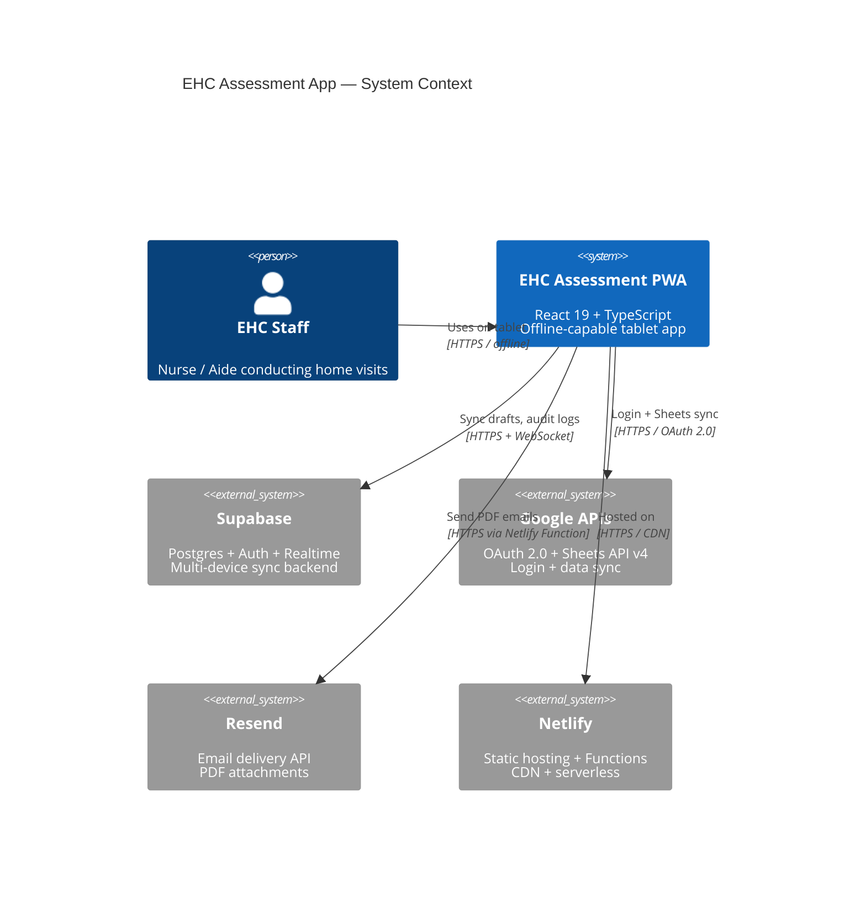

### Simplified Integration Map

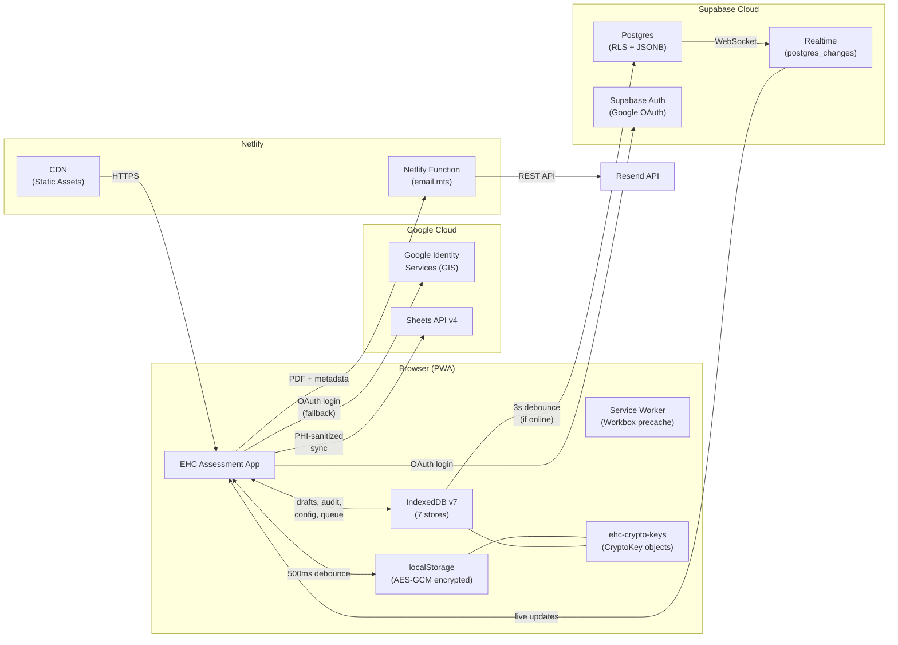

---

## 2. React Component Hierarchy

```mermaid
flowchart TD
    App["<b>App.tsx</b><br/>Root: view routing + auth gate"]

    subgraph Auth ["Auth Layer"]
        Login["LoginScreen<br/>(Google OAuth)"]
    end

    subgraph Views ["Main Views"]
        Dash["Dashboard<br/>(4 cards)"]
        AW["AssessmentWizard<br/>(7 steps)"]
        SCW["ServiceContractWizard<br/>(7 steps)"]
        DM["DraftManager<br/>(search + filters)"]
        Settings["SettingsScreen<br/>(6 sections)"]
    end

    subgraph WizardInternals ["Wizard Internals"]
        WS["WizardShell"]
        PB["ProgressBar"]
        EB["ErrorBoundary"]
    end

    subgraph AssessmentForms ["Assessment Forms (7)"]
        F1["ClientHelpList"]
        F2["ClientHistory"]
        F3["ClientAssessment"]
        F4["HomeSafetyChecklist"]
        F5["MedicationList"]
        F6["ConsentSignature"]
        F7a["ReviewSubmit"]
    end

    subgraph ContractForms ["Contract Forms (7)"]
        CF1["CustomerInfo"]
        CF2["TermsConditions"]
        CF3["ConsumerRights"]
        CF4["DirectCareWorker"]
        CF5["TransportationRequest"]
        CF6["CustomerPacket"]
        CF7["ReviewSubmit"]
    end

    subgraph SharedUI ["Shared UI Components"]
        TC["ToggleCard /<br/>ToggleCardGroup"]
        CC["CategoryCard"]
        SP["SignaturePad"]
        IP["InitialsPad"]
        TT["ThemeToggle"]
        ECM["EmailComposeModal"]
        CRM["ConflictResolutionModal"]
        CD["ConfirmDialog"]
        AC["AddressAutocomplete"]
        HM["HelpModal"]
    end

    subgraph Hooks ["Custom Hooks"]
        H1["useAutoSave"]
        H2["useFormWizard"]
        H3["useStepValidation"]
        H4["useIdleTimeout"]
        H5["useDarkMode"]
        H6["useFocusTrap"]
        H7["useOnlineStatus"]
        H8["useSupabaseAuth"]
        H9["useSupabaseSync"]
        H10["useSupabaseDrafts"]
        H11["useDraftLock"]
        H12["useSheetsSync"]
    end

    App --> Login
    App --> Dash
    App --> AW
    App --> SCW
    App --> DM
    App --> Settings

    AW --> WS
    AW --> EB
    SCW --> WS
    SCW --> EB
    WS --> PB

    AW --> F1 & F2 & F3 & F4 & F5 & F6 & F7a
    SCW --> CF1 & CF2 & CF3 & CF4 & CF5 & CF6 & CF7

    F3 --> TC
    F4 --> TC
    F6 --> SP
    CF2 --> IP
    CF3 --> SP
    CF4 --> SP
    CF5 --> SP
    CF6 --> SP

    AW --> H1 & H2 & H3 & H9 & H11
    SCW --> H1 & H2 & H3 & H9 & H11
    App --> H4 & H5 & H8

    AW --> CRM
    SCW --> CRM
    AW --> ECM
    SCW --> ECM
```

---

## 3. Navigation State Machine

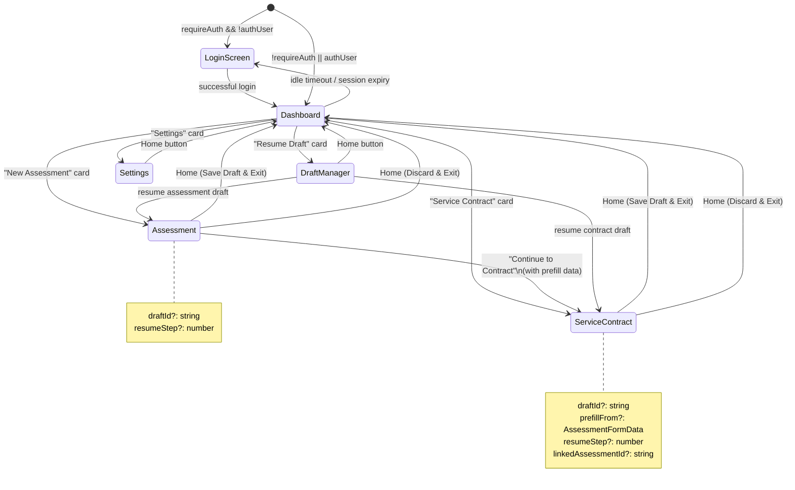

---

## 4. Supabase Sync Architecture

### Local-First Data Flow

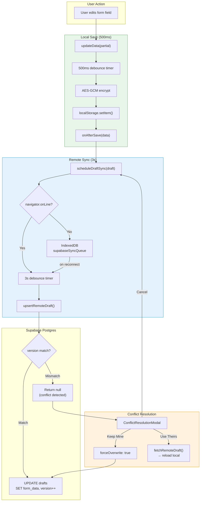

### Sync State Diagram

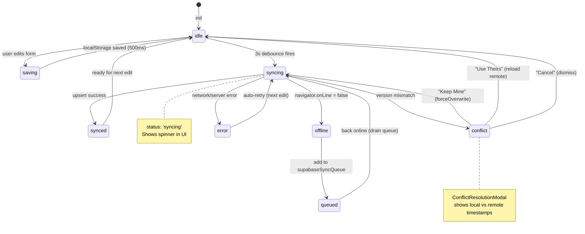

### Realtime Subscription Flow

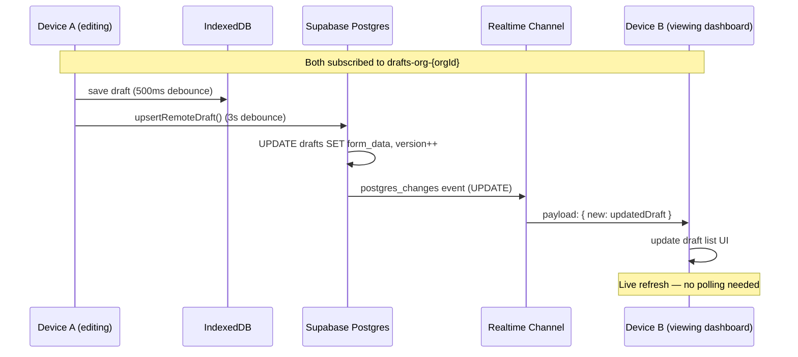

---

## 5. Draft Lifecycle & Locking

### Draft State Machine

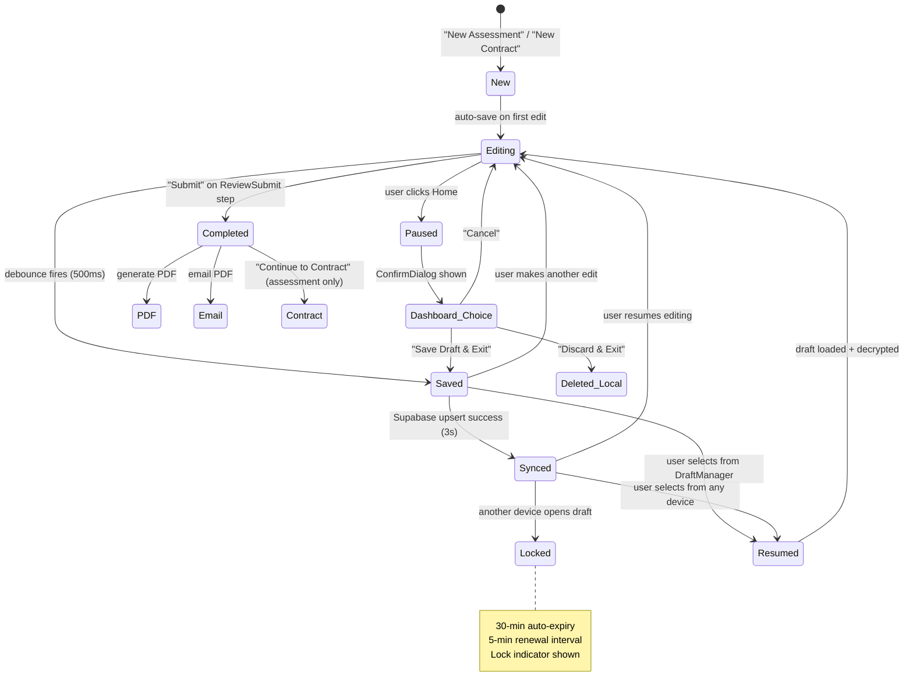

### Draft Lock Sequence

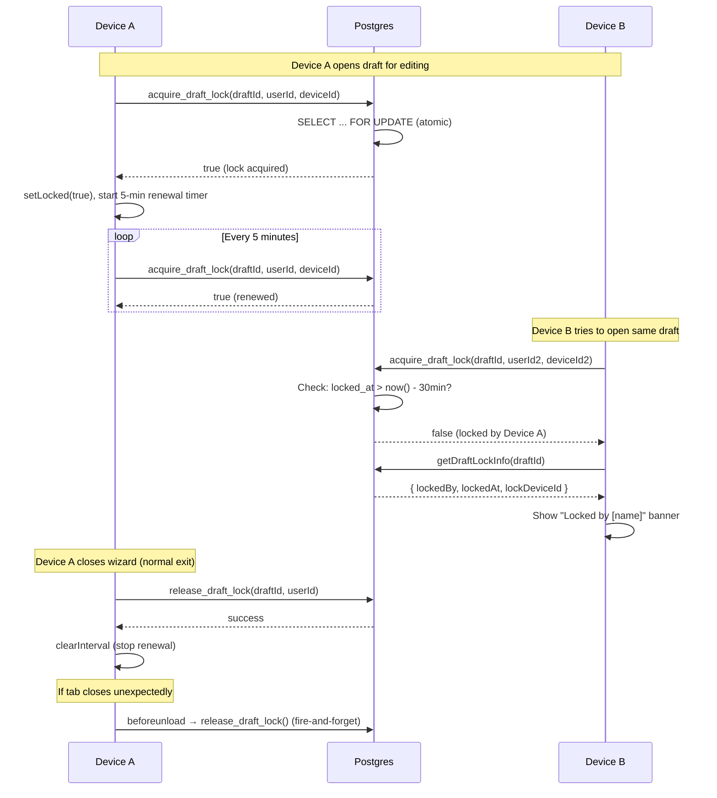

---

## 6. Authentication Flow

### Auth Decision Tree

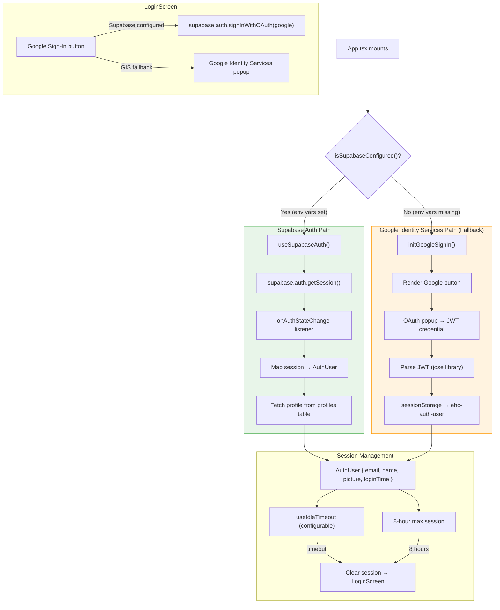

---

## 7. Assessment Creation Workflow

End-to-end workflow from starting an assessment through PDF delivery.

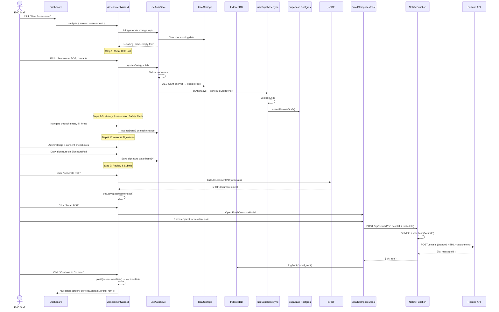

---

## 8. Conflict Resolution Sequence

Detailed flow when two devices edit the same draft.

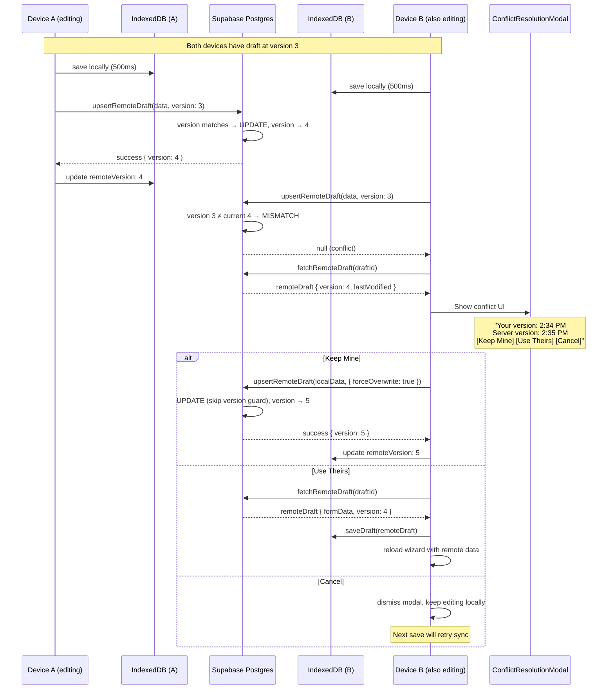

---

## 9. PDF Email Delivery Sequence

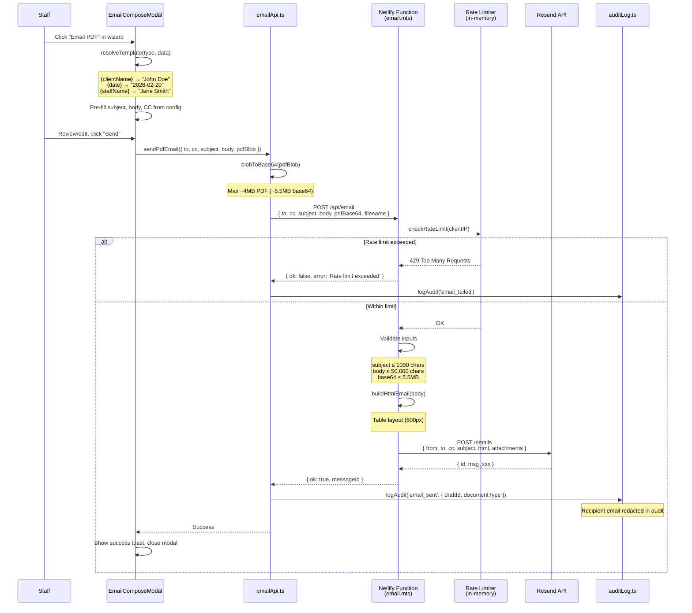

---

## 10. Encryption & Key Management

### Key Hierarchy

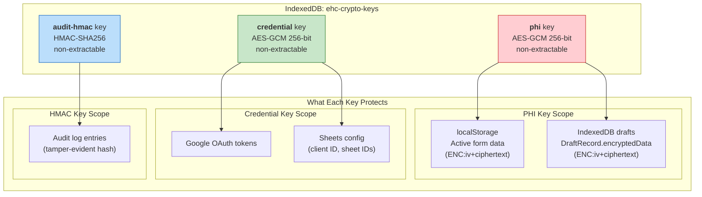

### Encryption Format

```mermaid
flowchart LR
    Plain["Plaintext<br/>(form JSON)"]
    -->|"crypto.subtle.encrypt()"| Cipher["IV (12 bytes) + Ciphertext"]
    -->|"base64 encode"| Stored["<b>ENC:</b>base64string"]

    Stored -->|"detect ENC: prefix"| Decode["base64 decode"]
    -->|"split IV + ciphertext"| Decrypt["crypto.subtle.decrypt()"]
    -->|"JSON.parse()"| Plain2["Plaintext<br/>(form JSON)"]

    style Plain fill:#e8f5e9
    style Stored fill:#fff3e0
    style Plain2 fill:#e8f5e9
```

---

## 11. IndexedDB Schema

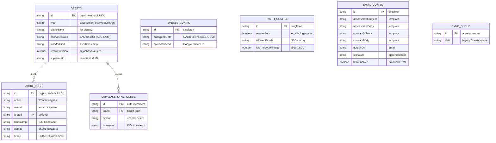

### Supabase Postgres Schema

```mermaid
erDiagram
    ORGANIZATIONS {
        uuid id PK
        text name
        text slug UK
        jsonb settings
        timestamptz created_at
    }

    PROFILES {
        uuid id PK "= auth.uid()"
        uuid org_id FK
        text email
        text full_name
        text avatar_url
        text role "owner | admin | staff"
        timestamptz created_at
    }

    DRAFTS {
        uuid id PK
        uuid org_id FK
        text user_id FK
        text type "assessment | serviceContract"
        text client_name
        jsonb form_data "full form state"
        integer version "auto-increment trigger"
        text locked_by "user_id or null"
        timestamptz locked_at
        text lock_device_id
        timestamptz created_at
        timestamptz updated_at
    }

    AUDIT_LOGS {
        uuid id PK
        uuid org_id FK
        text user_email
        text action "27+ action types"
        text draft_id FK
        jsonb details
        timestamptz created_at
    }

    APP_CONFIG {
        uuid id PK
        uuid org_id FK UK
        jsonb config "per-org settings"
        timestamptz updated_at
    }

    ORGANIZATIONS ||--o{ PROFILES : "org_id"
    ORGANIZATIONS ||--o{ DRAFTS : "org_id"
    ORGANIZATIONS ||--o{ AUDIT_LOGS : "org_id"
    ORGANIZATIONS ||--|| APP_CONFIG : "org_id"
    PROFILES ||--o{ DRAFTS : "user_id"
```

---

## Appendix: Key Timing Constants

| Constant | Value | Location | Purpose |
|----------|-------|----------|---------|
| `SAVE_DEBOUNCE_MS` | 500ms | useAutoSave.ts | Local save debounce |
| `REMOTE_SYNC_DEBOUNCE_MS` | 3000ms | useSupabaseSync.ts | Supabase push debounce |
| `LOCK_RENEWAL_INTERVAL_MS` | 5 min | useDraftLock.ts | Lock heartbeat |
| Lock expiry | 30 min | schema.sql | Server-side lock TTL |
| Idle timeout | 5/10/15/30 min | useIdleTimeout.ts | Configurable in Settings |
| Session max | 8 hours | App.tsx | Max login duration |
| Rate limit | 5/min/IP | email.mts | Email send rate |
| GIS token | ~1 hour | Google API | Token lifetime (no refresh) |
| Debounce (address) | 300ms | AddressAutocomplete | Geocoding API calls |
| Fetch timeout | 3-30s | fetchWithTimeout.ts | Network request timeout |

---

*Generated 2026-02-20 — Session 41: Supabase multi-device sync documentation*
